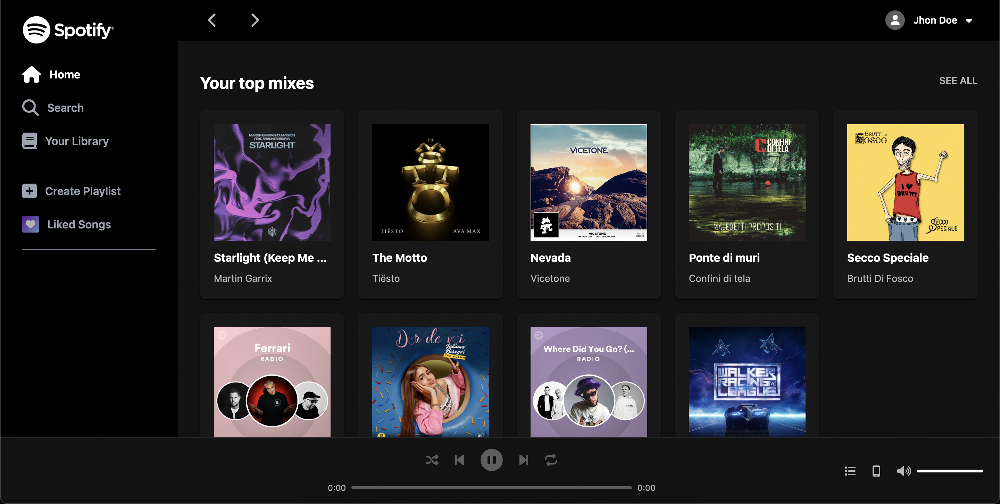

# Svelte Microfrontends Spotify

## Getting started

From this directory execute:

- npm run install:deps
- npm run serve:remote
- npm run serve:host (in a different terminal)

Open your browser at http://localhost:5173/ to see the amazing result

### Thanks

I took ispiration from this React project https://github.com/tayfunerbilen/react-tailwind-spotify-clone
